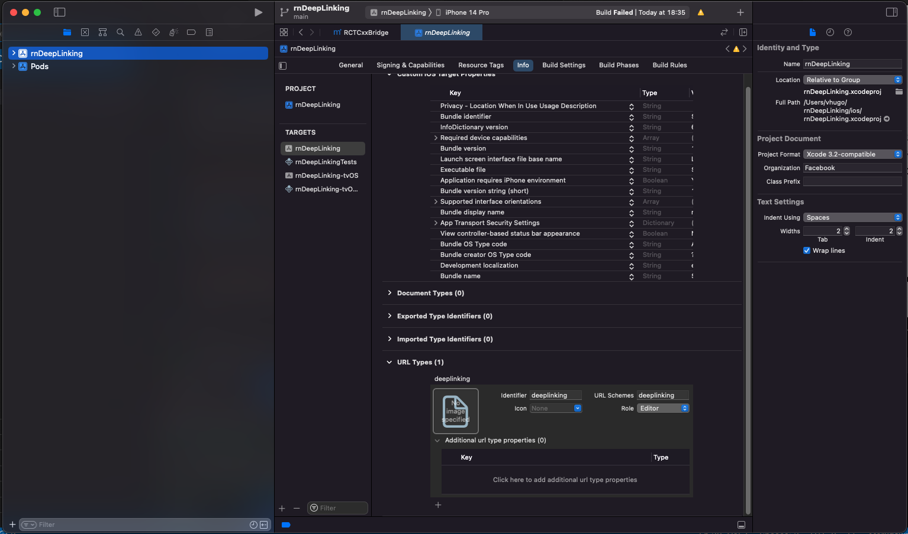
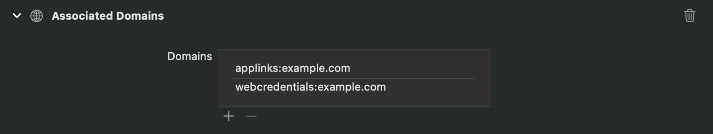
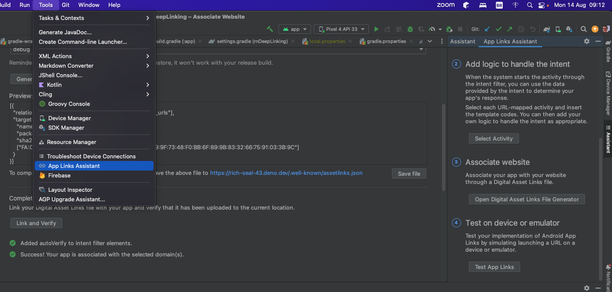

## React Native Deep Linking (bare workflow)

This project was created as POC for DeepLinking on `React Native 0.61.5` and `React Navigation 5.x`.

#### Requirements
- Node v14.0.0
- Java 1.8.0
- XCode 12.5

### Set up Deep Linking
The project is configured to open based on `deeplinking://` URI scheme, here you can use any you want.

#### iOS 

We need to link `RCTLinking` to the project. sicne this project is targeting iOS 11 (9.x or newer) we are going to add this to [`Project/ios/Project/AppDelegate.m`](rnDeeplinking/ios/rnDeepLinking/AppDelegate.m) 

```objective-c
  // Add the header at the top of the file:
  #import <React/RCTLinkingManager.h>

  // Add this inside `@implementation AppDelegate` above `@end`:
  - (BOOL)application:(UIApplication *)application
    openURL:(NSURL *)url
    options:(NSDictionary<UIApplicationOpenURLOptionsKey,id> *)options
  {
    return [RCTLinkingManager application:application openURL:url options:options];
  }
```

##### Configuring Scheme:
To add it manually we open the project in xCode. Select the project in sidebar and navigate to the info tab. Scroll down to "URL Types" and add one. set both identifier and the URL scheme to your desired URL scheme.



[iOS Docs Reference](https://reactnavigation.org/docs/5.x/deep-linking/#ios)

#### Android
To configure the external linking in Android, we create a new intent in the manifest.

In this project we are adding it manually, so open [`Project/android/app/src/main/AndroidManifest.xml`](rnDeeplinking/android/app/src/main/AndroidManifest.xml) we made the following adjustments:

```xml
  <activity
    android:name=".MainActivity"
    android:launchMode="singleTask">
    <intent-filter>
        <action android:name="android.intent.action.MAIN" />
        <category android:name="android.intent.category.LAUNCHER" />
    </intent-filter>
    <!-- The following intent filter was added -->
    <intent-filter>
        <action android:name="android.intent.action.VIEW" />
        <category android:name="android.intent.category.DEFAULT" />
        <category android:name="android.intent.category.BROWSABLE" />
        <data android:scheme="deeplinking" />
    </intent-filter>
</activity>
```
[Android Docs Reference](https://reactnavigation.org/docs/5.x/deep-linking/#android)

### Configuring Navigation Links

The `NavigationContainer` accepts a `linking`` prop that makes it easier to handle incoming links. The 2 of the most important properties you can specify in the linking prop are `prefixes` and `config`: 

```js
const config = {
  screens: {
    Second: {
      // This is the template for the deeplinking
      path: 'screen/:id',
      parse: {
        // This is used to parse the id from path to screen param
        id: id => `user-${id}`,
      },
    },
  },
};

const linking = {
  prefixes: ['deeplinking://', "https://rich-seal-43.deno.dev/"],
  config,
};

...
function App() {
  return (
    // linking need to be passed down to Navigation Container
    <NavigationContainer linking={linking} >
    ...
    </NavigationContainer>
  );
}
...
```

[Configuring Links Docs Reference](https://reactnavigation.org/docs/5.x/configuring-links/)

### Testing

#### iOS

This will open app on second screen passing the param `id={001}`

`xcrun simctl openurl booted deeplinking://screen/:001`

To test using universal links
`xcrun simctl openurl booted https://rich-seal-43.deno.dev/screen/:002`

#### Android
This will open app on second screen passing the param `id={002}`
`adb shell am start -W -a android.intent.action.VIEW -d "deeplinking://screen/:002" com.rndeeplinking`

To test using universal links
`adb shell am start -W -a android.intent.action.VIEW -d https://rich-seal-43.deno.dev/screen/:002`

#### Setup iOS Universal Links
Add to `AppDelegate.m` the following code

```objective-c
- (BOOL)application:(UIApplication *)application continueUserActivity:(nonnull NSUserActivity *)userActivity
 restorationHandler:(nonnull void (^)(NSArray<id<UIUserActivityRestoring>> * _Nullable))restorationHandler
{
 return [RCTLinkingManager application:application
                  continueUserActivity:userActivity
                    restorationHandler:restorationHandler];
}
``````

#### Add Associated Domains
To add your domain to the entitlement, click Add (+) at the bottom of the Domains table to add a placeholder domain. Replace the placeholder with the appropriate prefix for the service your app supports and your site’s domain. Make sure to only include the desired subdomain and the top-level domain. Don’t include path and query components or a trailing slash (/).



[Apple Docs](https://developer.apple.com/documentation/xcode/supporting-associated-domains)

#### Setup Android App Links
We need to add to the intent filter the `android:autoVerify="true"` and add `<data android:scheme="https" android:host="example.com" />` 
```xml
  <activity
    android:name=".MainActivity"
    android:launchMode="singleTask">
    <intent-filter>
        <action android:name="android.intent.action.MAIN" />
        <category android:name="android.intent.category.LAUNCHER" />
    </intent-filter>
    <!-- The following intent filter was added -->
    <intent-filter android:autoVerify="true">
        <action android:name="android.intent.action.VIEW" />
        <category android:name="android.intent.category.DEFAULT" />
        <category android:name="android.intent.category.BROWSABLE" />
        <data android:scheme="https" android:host="example.com" />
    </intent-filter>
</activity>
```

## Backend


In order to unversal links to work we need to serve some structured JSON to establish trust.

### iOS

Create a new file named `apple-app-site-association`.
It **must** return a MIME type of application/json and contain no file type, i.e. do not add .json to the file name.
```js
{
  "applinks": {
    "apps": [
      
    ],
    "details": [
      {
        //TeamID.BundleID
        "appID": "KV5Q2MF8Z5.org.thorugoh.rnDeepLinking",
        "paths": [
          "*"
        ]
      }
    ]
  }
}


```
To avoid repetition or having a separate config for iOS an Android, we’ll just handle paths with our logic in React Native.

for this project the path will be served in
[https://rich-seal-43.deno.dev/apple-app-site-association](https://rich-seal-43.deno.dev/apple-app-site-association)

After making this file available it may take up to 48 hours for Apple’s CDN to scrape and validate when the app is first installed and a universal link is first used.


### Android

To begin, we need to create a ‘Digital Asset Links’ JSON file to be served from each subdomain we want to provide Deep Links to.

Create a new file named assetlinks.json to be served from this folder: https://rich-seal-43.deno.dev/.well-known

To generate assetLinks.json file on android



## Redirecting to Store

The universal link will redirect to web browser in case we don't have the app installed, so in order to navigate to app store we just need to serve a page with the path of the link that when accessed will redirect to the desired store.

Here we have an example [page](/universalLinksServer/static/index.html)