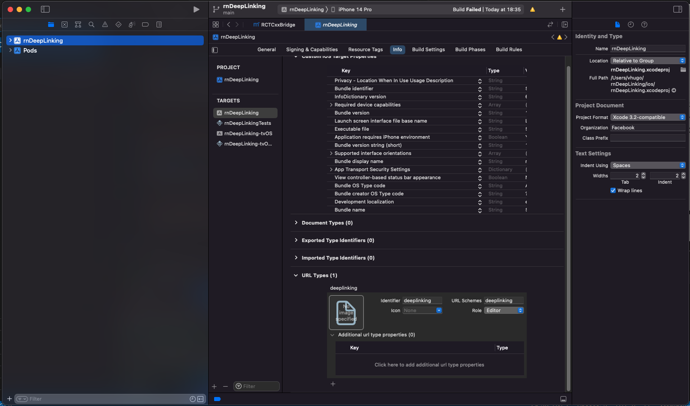

## React Native Deep Linking (bare workflow)

This project was created as POC for DeepLinking on `React Native 0.61.5` and `React Navigation 5.x`.

#### Requirements
- Node v14.0.0
- Java 1.8.0
- XCode 12.5

### Set up Deep Linking
The project is configured to open based on `deeplinking://` URI scheme, here you can use any you want.

#### iOS 

We need to link `RCTLinking` to the project. sicne this project is targeting iOS 11 (9.x or newer) we are going to add this to [`Project/ios/Project/AppDelegate.m`](/ios/rnDeepLinking/AppDelegate.m) 

```objective-c
  // Add the header at the top of the file:
  #import <React/RCTLinkingManager.h>

  // Add this inside `@implementation AppDelegate` above `@end`:
  - (BOOL)application:(UIApplication *)application
    openURL:(NSURL *)url
    options:(NSDictionary<UIApplicationOpenURLOptionsKey,id> *)options
  {
    return [RCTLinkingManager application:application openURL:url options:options];
  }
```

##### Configuring Scheme:
To add it manually we open the project in xCode. Select the project in sidebar and navigate to the info tab. Scroll down to "URL Types" and add one. set both identifier and the URL scheme to your desired URL scheme.



[iOS Docs Reference](https://reactnavigation.org/docs/5.x/deep-linking/#ios)

#### Android
To configure the external linking in Android, we create a new intent in the manifest.

In this project we are adding it manually, so open [`Project/android/app/src/main/AndroidManifest.xml`](/android/app/src/main/AndroidManifest.xml) we made the following adjustments:

```xml
  <activity
    android:name=".MainActivity"
    android:launchMode="singleTask">
    <intent-filter>
        <action android:name="android.intent.action.MAIN" />
        <category android:name="android.intent.category.LAUNCHER" />
    </intent-filter>
    <!-- The following intent filter was added -->
    <intent-filter>
        <action android:name="android.intent.action.VIEW" />
        <category android:name="android.intent.category.DEFAULT" />
        <category android:name="android.intent.category.BROWSABLE" />
        <data android:scheme="deeplinking" />
    </intent-filter>
</activity>
```
[Android Docs Reference](https://reactnavigation.org/docs/5.x/deep-linking/#android)

### Configuring Navigation Links

The `NavigationContainer` accepts a `linking`` prop that makes it easier to handle incoming links. The 2 of the most important properties you can specify in the linking prop are `prefixes` and `config`: 

```js
const config = {
  screens: {
    Second: {
      // This is the template for the deeplinking
      path: 'screen/:id',
      parse: {
        // This is used to parse the id from path to screen param
        id: id => `user-${id}`,
      },
    },
  },
};

const linking = {
  prefixes: ['deeplinking://'],
  config,
};

...
function App() {
  return (
    // linking need to be passed down to Navigation Container
    <NavigationContainer linking={linking} >
    ...
    </NavigationContainer>
  );
}
...
```

[Configuring Links Docs Reference](https://reactnavigation.org/docs/5.x/configuring-links/)

### Testing

#### iOS

This will open app on second screen passing the param `id={001}`

`xcrun simctl openurl booted deeplinking://screen/:001`

#### Android
This will open app on second screen passing the param `id={002}`
`adb shell am start -W -a android.intent.action.VIEW -d "deeplinking://screen/:002" com.rndeeplinking`
